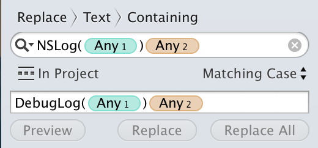
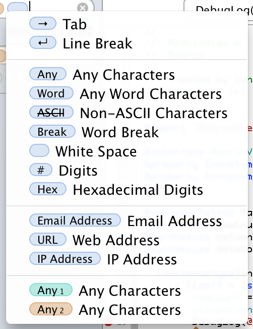

##ASLogger
An (almost) drop in replacement for `NSLog()` that logs using the [Apple System Log](https://developer.apple.com/library/mac/documentation/Darwin/Reference/ManPages/man3/asl.3.html). More flexible, performant, and accepted than logging using NSLog.

###Common Usage

Replace `NSLog()` across most of your codebase with `DebugLog()`. You can do this in Xcode per-file or project wide.

To do so in Xcode 6:

You can insert patterns using the key shortcut Control-Option-Command-P:

###Using Log Levels

Example of EmergencyLog:

    EmergencyLog(@"The system is going down now!");

Example of CriticalLog:

    CriticalLog(@"#TheSituation is Critical!");

Example of ErrorLog:

    ErrorLog(@"Encountered an error: %@", error);

Example of WarningLog:

    WarningLog(@"You are almost out of disk space.")

Example of NoticeLog:

	NoticeLog(@"Eh, something happened"s");

Example of InfoLog:

	InfoLog(@"I don't want to bother you, but...");

Example of DebugLog:

    DebugLog(@"OMG the string was #nil!");

Apple best practices for logging are documented in the [Daemons and Services Programming Guide](https://developer.apple.com/library/mac/documentation/MacOSX/Conceptual/BPSystemStartup/Chapters/LoggingErrorsAndWarnings.html)